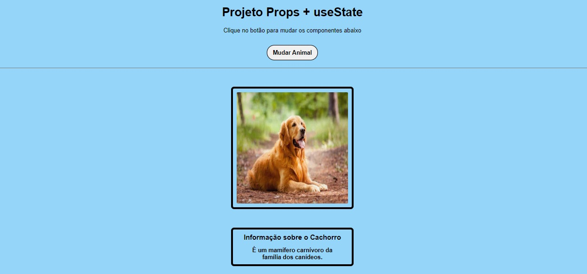

<h1 align="center"> Props + useState </h1>

 

  

## 🚀 Tecnologias

Esse projeto foi desenvolvido com as seguintes tecnologias:

- React
- JavaScript
- HTML e CSS
- Git e Github

## 💻 Projeto

Estudo pessoal sobre o uso do Props + useState com componentização.

---

Feito por João Meireles :wave: [Linkedin](https://www.linkedin.com/in/jpw-meireles/)